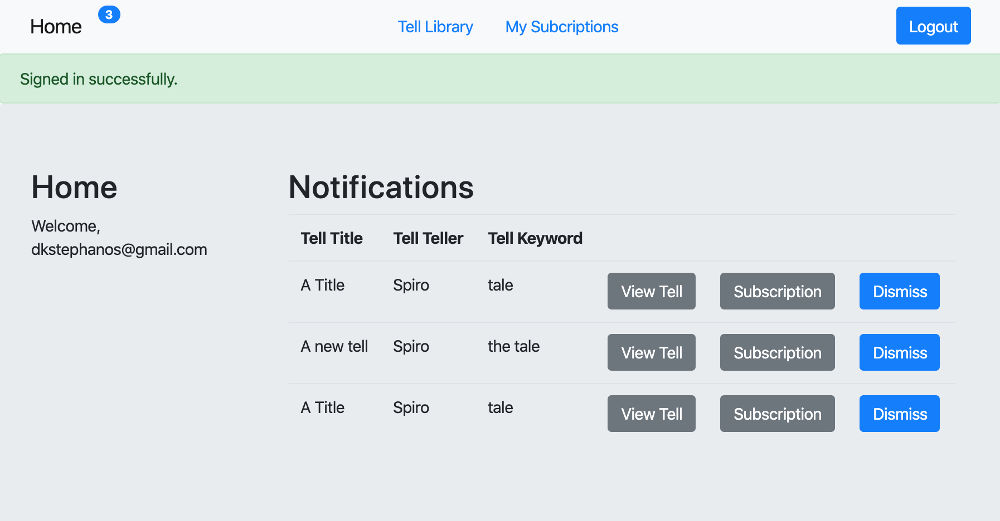

# StorytellingPubSub

A publish-subscribe implementation for storytelling records. Built in Ruby on Rails with sqlite3 database.

## Getting Started

### Prerequisites

Need a Ruby (2.5.1) on Rails (6.0.2) environment

### Installing Running

Run 'bundle install'

Then 'rake db:migrate'

Finally 'rails server'

## Authors

* **Koi Stephanos** - *Source Reference* - [What is Pub-Sub?](https://www.toptal.com/ruby-on-rails/the-publish-subscribe-pattern-on-rails)

## License

This project is licensed under the MIT License - see the [LICENSE.md](LICENSE.md) file for details
